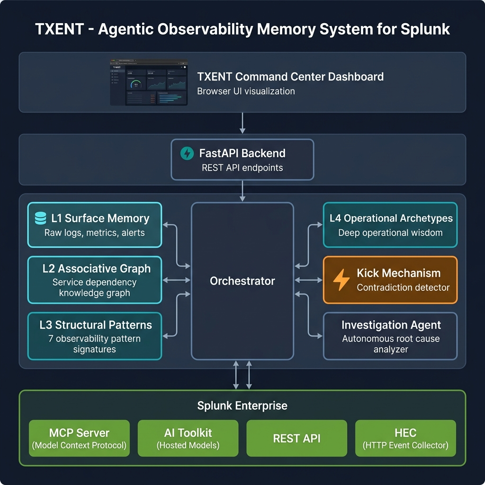

<div align="center">

# 🧠 TXENT — Agentic Observability Memory System for Splunk

[](https://python.org)
[](https://fastapi.tiangolo.com)
[](https://www.splunk.com)
[](LICENSE)
[](https://www.splunk.com)

**An AI-powered observability agent that doesn't just alert — it _remembers_, _reasons_, and _investigates_.**

TXENT transforms raw Splunk logs, alerts, and metrics into a persistent 4-layer memory architecture. When a new incident arrives, TXENT compares it against historical operational patterns and fires a **Kick** when contradictions are detected — triggering a fully autonomous investigation agent that queries Splunk, builds evidence timelines, and delivers root-cause analysis in seconds, not hours.

</div>

---

## 📑 Table of Contents

- [Key Innovation: The Kick Mechanism](#-key-innovation-the-kick-mechanism)
- [Architecture Overview](#-architecture-overview)
- [Features](#-features)
- [Quick Start](#-quick-start)
- [Splunk Enterprise Setup](#-splunk-enterprise-setup)
- [API Reference](#-api-reference)
- [Testing](#-testing)
- [Project Structure](#-project-structure)
- [License](#-license)

---

## ⚡ Key Innovation: The Kick Mechanism

> *"The most dangerous incidents are the ones that look routine on the surface."*

Traditional observability tools react to thresholds. TXENT goes deeper. The **Kick Mechanism** (`core/kick.py`) continuously compares incoming surface alerts against learned structural patterns and operational archetypes:

```
┌──────────────┐     ┌──────────────────┐     ┌───────────────┐
│  New Alert    │────▶│  Kick Detector   │────▶│  Contradiction │
│  "DB Timeout" │     │  (Semantic +     │     │  Score > 0.42  │
└──────────────┘     │  Topological)    │     └───────┬───────┘
                     └──────────────────┘             │
                                                      ▼
                                              ┌───────────────┐
                                              │  🔥 KICK FIRES │
                                              │  Agent Launches │
                                              └───────┬───────┘
                                                      │
                              ┌────────────────────────┼────────────────────────┐
                              ▼                        ▼                        ▼
                     ┌────────────────┐     ┌──────────────────┐     ┌──────────────────┐
                     │ Query Splunk   │     │ Build Evidence   │     │ Root Cause       │
                     │ REST / MCP     │     │ Timeline         │     │ Report + Actions │
                     └────────────────┘     └──────────────────┘     └──────────────────┘
```

**Example**: A "Database Connection Timeout" alert arrives. A naive system escalates it as a DB issue. TXENT's Kick Detector recognizes the topological signature of **Cache Saturation** — the database timeouts are a downstream _symptom_, not the root cause. The agent then autonomously queries Splunk to confirm Redis memory exhaustion and recommends scaling the cache cluster.

---

## 🏗️ Architecture Overview

TXENT is built on a **4-layer cognitive memory architecture** inspired by how expert SREs build operational intuition over years:



| Layer | Module | Purpose |
|-------|--------|---------|
| **L1 — Surface Memory** | `layers/l1_surface.py` | Stores raw logs, alerts, and metric snapshots with structured metadata (`incident_id`, `timestamp`, `severity`, `service`, `environment`, `source`). Fast vector search for semantic retrieval. |
| **L2 — Associative Graph** | `layers/l2_associative.py` | Maps service relationships via a knowledge graph (e.g., `payment-api` → `redis-cache` → `postgres-db`). Enables topological traversal and impact radius analysis. |
| **L3 — Structural Patterns** | `layers/l3_structural.py` | Matches active incidents against **7 observability pattern signatures**: Resource Exhaustion, Cache Saturation, Cascading Failure, Network Partition, Dependency Failure, Traffic Spike, and Configuration Drift. |
| **L4 — Operational Archetypes** | `layers/l4_archetypes.py` | Encapsulates deep operational priors and wisdom rules — the kind of knowledge senior SREs carry (e.g., "cache saturation often manifests as database connection exhaustion"). |

### Supporting Components

| Component | Module | Role |
|-----------|--------|------|
| **Kick Detector** | `core/kick.py` | Fires when surface alerts contradict historical structural patterns (divergence > configurable threshold). |
| **Investigation Agent** | `agents/investigator.py` | Autonomous agent that runs Splunk queries, builds evidence timelines, and compiles root-cause reports with actionable remediations. |
| **Splunk Connector** | `connectors/splunk.py` | Integrates with Splunk Enterprise REST API, Splunk MCP Server, and HTTP Event Collector. Includes high-fidelity simulation fallback for demo/development. |
| **FastAPI Backend** | `api/main.py` | Full REST API with SSE streaming, health checks, memory management, and incident simulation endpoints. |
| **Command Center UI** | `frontend/txent.html` | Real-time interactive dashboard for monitoring incidents, viewing investigations, and executing remediations. |

---

## ✨ Features

- 🔍 **4-Layer Memory Retrieval** — Surface → Associative → Structural → Archetype layered reasoning
- ⚡ **Kick Mechanism** — Automatic contradiction detection between surface alerts and deep patterns
- 🤖 **Autonomous Investigation** — Agent queries Splunk, builds timelines, and reports root cause
- 🔗 **Splunk Enterprise Integration** — REST API, MCP Server, and HEC bidirectional data flow
- 📊 **Real-Time Dashboard** — Interactive command center with live SSE streaming
- 🧪 **Incident Simulation** — Trigger realistic observability scenarios for testing and demos
- 🎯 **7 Pattern Signatures** — Pre-built structural patterns for common operational failure modes
- 💡 **Remediation Actions** — Actionable recommendations that can be executed from the UI
- 🪶 **Zero-Dependency Fallbacks** — Pure Python implementations (no GPU, no Docker required)
- 🖥️ **Windows Native** — Runs out of the box on Windows with Python 3.10+

---

## 🚀 Quick Start

### Prerequisites

- Python 3.10 or higher
- pip (Python package manager)
- (Optional) Splunk Enterprise instance for live integration

### 1. Clone the Repository

```bash
git clone https://github.com/your-org/txent.git
cd txent
```

### 2. Install Dependencies

```bash
pip install -r requirements.txt
```

### 3. Configure Environment

```bash
cp .env.example .env
```

Edit `.env` with your settings:

```ini
# Core settings
KICK_THRESHOLD=0.42
API_PORT=8000

# Splunk Enterprise (optional — simulator runs without these)
SPLUNK_HOST=https://your-splunk-instance:8089
SPLUNK_TOKEN=your-splunk-auth-token
SPLUNK_MCP_URL=http://localhost:3000

# LLM backend (optional — retrieval-based answers work without LLM)
LLM_URL=http://localhost:8001/v1/chat/completions
LLM_MODEL=meta-llama/Meta-Llama-3-8B-Instruct
```

### 4. Start the Server

```bash
python -m uvicorn api.main:app --host 0.0.0.0 --port 8000 --reload
```

### 5. Open the Dashboard

Navigate to **[http://localhost:8000](http://localhost:8000)** in your browser.

You'll see the TXENT Command Center — trigger a simulated incident, watch the Kick mechanism fire, and observe the autonomous investigation unfold in real time.

---

## 🔌 Splunk Enterprise Setup

TXENT connects to Splunk through three integration points:

| Integration | Env Variable | Purpose |
|-------------|-------------|---------|
| **REST API** | `SPLUNK_HOST` | Search queries, metrics retrieval, index data |
| **MCP Server** | `SPLUNK_MCP_URL` | Model Context Protocol for structured agent-Splunk communication |
| **HEC** | *(via REST API)* | Bidirectional event ingestion from TXENT back into Splunk |

### Connecting to Splunk Enterprise

1. **Generate an auth token** in Splunk: *Settings → Tokens → New Token*
2. **Set environment variables** in your `.env`:
   ```ini
   SPLUNK_HOST=https://your-splunk-host:8089
   SPLUNK_TOKEN=your-auth-token
   ```
3. **Install the Splunk MCP Server** (optional, for Model Context Protocol integration):
   ```ini
   SPLUNK_MCP_URL=http://localhost:3000
   ```
4. **Verify connectivity**:
   ```bash
   curl http://localhost:8000/api/splunk/status
   ```

> [!TIP]
> **No Splunk instance?** No problem. TXENT includes a high-fidelity simulation mode that generates realistic metrics, incidents, and service topologies. The simulator activates automatically when Splunk environment variables are not configured.

---

## 📡 API Reference

| Method | Endpoint | Description |
|--------|----------|-------------|
| `GET` | `/` | Serves the TXENT Command Center dashboard |
| `GET` | `/health` | System health, layer status, Splunk connectivity |
| `GET` | `/health/llm` | LLM backend reachability check |
| `POST` | `/ingest` | Ingest text into L1 surface memory |
| `POST` | `/ingest/batch` | Batch ingest multiple documents |
| `POST` | `/ingest/file` | Ingest uploaded files (PDF, TXT) |
| `POST` | `/ingest/url` | Ingest content from a URL |
| `POST` | `/retrieve` | Full 4-layer retrieval with Kick evaluation |
| `POST` | `/retrieve/stream` | SSE-streamed retrieval with live token output |
| `POST` | `/node/expand` | Expand a knowledge graph node with LLM context |
| `GET` | `/graph` | Retrieve the L2 associative knowledge graph |
| `GET` | `/schemas` | List all L3 structural pattern schemas |
| `GET` | `/stats` | Aggregated system statistics |
| `GET` | `/metrics` | Compact metrics for monitoring |
| `GET` | `/sources` | List all ingested data sources |
| `DELETE` | `/sources/{id}` | Remove a data source |
| `GET` | `/api/splunk/status` | Splunk Enterprise & MCP connection status |
| `POST` | `/api/ingest/incident` | Trigger a simulated incident |
| `POST` | `/api/actions/execute` | Execute a recommended remediation action |
| `GET` | `/api/incidents` | List active and historical incidents |
| `POST` | `/memory/save` | Persist memory state to disk |
| `POST` | `/memory/load` | Restore memory state from disk |
| `DELETE` | `/memory` | Clear all memory layers |

Full interactive docs available at `/docs` (Swagger UI) when the server is running.

---

## 🧪 Testing

Run the full integration test suite that validates the L1–L4 memory flow, Splunk simulator, Kick mechanism, and autonomous investigator:

```powershell
# Windows (PowerShell)
$env:PYTHONPATH="."; python test/test_txent_flow.py
```

```bash
# Linux / macOS
PYTHONPATH=. python test/test_txent_flow.py
```

The test suite verifies:
- ✅ L1 Surface Memory ingestion and vector search
- ✅ L2 Associative Graph construction and traversal
- ✅ L3 Structural Pattern matching across all 7 signatures
- ✅ L4 Operational Archetype wisdom rule application
- ✅ Kick Mechanism contradiction detection and firing
- ✅ Autonomous Investigation Agent execution
- ✅ Splunk Connector simulation mode
- ✅ End-to-end retrieval pipeline

---

## 📁 Project Structure

```
TXENT/
├── agents/
│   └── investigator.py          # Autonomous investigation agent
├── api/
│   ├── __init__.py
│   └── main.py                  # FastAPI backend with SSE streaming
├── connectors/
│   └── splunk.py                # Splunk REST API / MCP / HEC connector
├── core/
│   ├── __init__.py
│   ├── kick.py                  # 🔥 Kick Mechanism — contradiction detector
│   └── orchestrator.py          # Central orchestrator wiring all layers
├── demo/
│   └── seed_data.py             # Demo seed data for quick showcases
├── frontend/
│   └── txent.html               # Interactive Command Center dashboard
├── layers/
│   ├── __init__.py
│   ├── l1_surface.py            # L1: Surface Memory (vector store)
│   ├── l2_associative.py        # L2: Associative Graph (knowledge graph)
│   ├── l3_structural.py         # L3: Structural Patterns (7 signatures)
│   └── l4_archetypes.py         # L4: Operational Archetypes (wisdom rules)
├── test/
│   └── test_txent_flow.py       # Integration test suite
├── .env.example                 # Environment variable template
├── requirements.txt             # Python dependencies
├── LICENSE                      # MIT License
└── README.md                    # You are here
```

---

## 📜 License

This project is licensed under the **MIT License** — see the [LICENSE](LICENSE) file for details.

---

<div align="center">

**Built for the [Splunk Agentic Ops Hackathon 2026](https://www.splunk.com)** 🏆

*TXENT — because observability should have a memory.*

</div>
